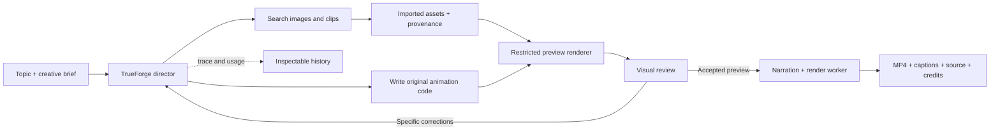
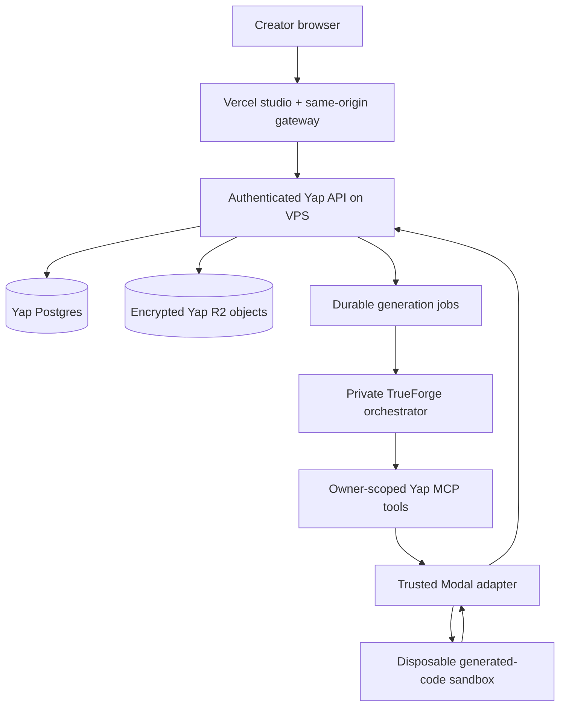

<div align="center">

<a href="https://educative-yap.vercel.app"></a>

# Big ideas. Little videos.

### An AI director that makes the edit.

[](LICENSE)
[](https://github.com/truefoundry/trueforge)
[](package.json)
[](docs/freeform-director.md)

**Give it an idea—or a recording of yourself teaching. Get an original animated explainer with narration, captions, sourced visuals and an editable project.**

[Open the studio ↗](https://educative-yap.vercel.app) · [Run with your own key](#run-it-locally) · [Inspect a real trace](docs/traces/korean-war.md) · [How costs work](#less-model-work-visible-costs)

**Open source · Hosted preview is invite-only · Built for Agents That Act: TrueFoundry × Polaris**

[Watch the demo (Google Drive)](https://drive.google.com/file/d/1Ofqhci3xFfUWFRKICFW5t_VyA4NEGtux/view) · [Download demo MP4](https://github.com/sanjuhs/educative-yap-trueforge-polaris-hack/raw/refs/heads/main/docs/demo/yap-demo.mp4) · [Submission writeup (one-page PDF)](solution-writeup.pdf)

Demo: **2:51.6**, with narration and an extended walkthrough of actual TrueForge sessions and tool calls. The 1920×1080 MP4 was upscaled from a 1280×720 OBS recording. [Recording details](docs/demo/README.md).

</div>

## From an idea to a finished explanation

> “Explain the Korean War in one minute. Show how the front moved, why China intervened, and why the armistice did not reunify Korea. Use moving maps, archival imagery and subtitles.”

Yap's director writes narration, designs shots, finds useful images or footage, writes the animation source, inspects rendered previews, repairs problems and exports a vertical video. A revision can change the whole design. There is no required scene-template catalog.

| You direct                                        | Yap creates                                  |
| ------------------------------------------------- | -------------------------------------------- |
| Topic, script or teaching notes                   | A narrated sequence of explanatory beats     |
| Your video and voice                              | Presenter cutout or split-screen explanation |
| Duration, model, reasoning and visual preferences | A custom HTML/CSS/SVG/Canvas animation       |
| Feedback on the result                            | A new version with its own source and output |

## A production workflow you can revise

1. **Brief the director.** Choose a topic or upload your teaching video, screenshots, photos or short clips. Set duration, visual mix, model and reasoning effort.
2. **Watch it act.** TrueForge calls real tools to find assets, author animation code, run a restricted preview and inspect actual frames. Critiques feed back into source revisions.
3. **Review the deliverable.** Play the MP4, inspect source credits and the AI cost estimate, and download the editable animation. Hosted jobs continue while the browser is closed.
4. **Make the next cut.** Select **Revise this video** and ask, for example: “Keep the opening, make the labels larger, and explain the turning point more slowly.” The director reads the saved project, writes a revised design, previews it and exports another project. Earlier versions remain available.

Useful workflows include teachers turning a lesson into a visual explanation, technical educators pairing their recording with diagrams, and product teams turning screenshots into narrated walkthroughs. These are intended uses; the [verified hosted run](deployment/demo-verification.md) demonstrates screenshot → agent → review → narration → Modal render → encrypted storage → playback.

Publishing stays with the creator: review facts, captions and media permissions before sharing the downloaded video. There is no autonomous social-posting, purchasing or creator-outreach tool.

## A real one-minute experiment


**60.17 seconds · eight beats · subtitles · two archival photographs · four seconds of sourced B-roll.**

[Inspect the 27-event trace and repair sequence](docs/traces/korean-war.md) · [Download the sanitized JSON](docs/traces/korean-war.json).

The experiment used GPT-6 Astra/high and approximately **$2.92** in recorded model usage plus audio estimates, including the interrupted run, revisions and audio checks. It exposed real problems: a ten-minute agent timeout, overlapping map labels, an omitted TTS sentence and approximate captions. The final artifact was repaired and checked. This is evidence from one experiment—not a promised price or proof that every generation is ready to publish.

[Read the experiment and its limitations](docs/experiments/korean-war.md). Images credit R. V. Spencer and Donald Douglas George Bushby; source metadata accompanies generated projects. Clips retain source URLs, channel names, timestamps and permission status.

## TrueForge does the work

Built as a standalone open-source project for **Agents That Act: TrueFoundry × Polaris**. TrueForge runs the actual agent loop; it is not a decorative integration around a separate director.



| TrueForge capability    | How Yap uses it                                                                                                       |
| ----------------------- | --------------------------------------------------------------------------------------------------------------------- |
| Stateful agent sessions | Keep the brief, tool results and revision context together                                                            |
| MCP tools               | Source assets, inspect excerpts, preview designs and enqueue renders                                                  |
| Model profiles          | Choose Luna, Sol or Astra and reasoning effort per session                                                            |
| Tool traces             | Inspect decisions, tool calls, errors and visual critiques                                                            |
| Agent/tool boundaries   | Separate creative direction from trusted media operations                                                             |
| Approval support        | Available in the harness; current local tools do not publish or contact creators, and require no interactive approval |

One TrueForge director owns the creative session and coordinates dedicated visual-review calls. Dynamic subagents are disabled in the shipped profiles, keeping model selection and usage accounting predictable.

### Inspect the agent, not just the final video

```text
search_web_images / search_youtube_clips  → find shot-specific sources
import_web_image / import_youtube_clip    → retain provenance; inspect footage
preview_design                           → run code, capture frames, visual critique
  REVISE: overlapping labels and boundary → director rewrites the animation
  REVISE: background obscures headings    → fix layering and map key
  [initial turn times out; user continues the saved session]
preview_design                           → READY, with remaining caveats
render_design                            → queued project; worker takes over
```

This is a condensed sequence from the actual Korean War run, including its interruption. The [trace guide](docs/traces/korean-war.md) provides timestamps, exact tool evidence, cost math and instructions for inspecting your own runs. The final audio/caption repair was a separate manual audit, documented in the experiment.

### Built for the hackathon's real-world job

| Challenge                                      | Evidence in Yap                                                                                                                 |
| ---------------------------------------------- | ------------------------------------------------------------------------------------------------------------------------------- |
| Reach real systems                             | Authenticated API, Postgres jobs/history, encrypted R2 media, source search and Modal rendering                                 |
| Execute generated code safely                  | Original HTML/CSS/JS runs in a disposable hosted renderer with blocked outbound networking and no injected provider credentials |
| Complete a useful workflow                     | Input → assets → animation → review → revisions → narrated MP4, credits and editable source                                     |
| Make actions inspectable                       | TrueForge events, saved designs, token categories and a sanitized recorded trace                                                |
| Keep consequential actions under human control | Creator reviews and downloads the result; external publishing, purchases and outreach are outside the tool surface              |

TrueForge supports approval flows, but Yap does not currently demonstrate a pause-and-approve publishing tool. The sandbox is implemented by Yap's Modal adapter. [Judge walkthrough](docs/launch.md#three-minute-judge-walkthrough) · [Implementation map](docs/architecture.md).

## Less model work, visible costs

Yap spends model tokens on direction and review. Browser rendering, FFmpeg export and progress polling make **zero additional model calls**. Revisions can reuse imported assets and the presenter's transcript. The director is instructed to bound visual repairs; the limit is guidance, not a hard spending cap.

| Recorded example                                    | Approximate AI cost | What it proves                                                                |
| --------------------------------------------------- | ------------------: | ----------------------------------------------------------------------------- |
| Luna/medium HTML/CSS explainer                      |         **$0.0269** | One lower-cost run, including narration and two visual reviews                |
| Astra/high hosted screenshot explainer, 9.4 seconds |           **$1.04** | Verified cloud generation, review, audio and export                           |
| Astra/high Korean War experiment, 60.17 seconds     |           **$2.92** | Both recorded director turns, reviews, replacement narration and audio checks |

These are different workloads, not a controlled model comparison or a per-video price promise. Compute, storage, network, licensing and unreported failed-call usage are excluded.

In the Korean War record, 197,045 cache-read tokens and 63,228 cache-write tokens yield a **$1.6153 net caching discount**, after the write premium, versus ordinary uncached input pricing for the same recorded tokens. That is provider prompt-cache pricing—not a measured TrueFoundry-versus-alternative saving. The [trace cost calculation](docs/traces/korean-war.md#cost-you-can-check) makes the baseline explicit.

The studio exposes model, effort, input/output tokens, cached reads, cache writes, reasoning, model/review counts and audio estimates. Unknown or incomplete usage stays unpriced. Estimates currently cover a generation turn, so earlier revisions must be added when reporting a whole project. Rates are sourced from [official OpenAI API pricing](https://developers.openai.com/api/docs/pricing), checked September 26, 2026. [Rate card and assumptions](docs/model-costs.md).

## Creative control without fixed templates

- **Custom motion:** causal diagrams, animated maps, procedural objects, camera movement and scene-specific compositions. The [animation skill](skills/animate-explainers/SKILL.md) is included in the director's instructions.
- **Your own visual library:** upload screenshots, photos and short video clips, select assets for a brief, and let the director arrange them. Preview each 3–30 second source clip and choose its 3–5 second excerpt before uploading. Imports retain descriptions and selected source timestamps for reuse; choose presenter mode to keep your voice.
- **Visual mix and opening:** set a footage share, photo share, pacing, text density and opening preference—clip first, dynamic graphics or director’s choice.
- **Real visual assets:** Wikimedia image search and optional autonomous YouTube excerpt search/import. No user-provided link is required. Relevance is checked from actual frames; metadata alone is not historical evidence.
- **Your performance:** keep your original recording and voice, with background removal or a split-screen composition.
- **Duration:** AI-voice targets from 5 seconds to 20 minutes in 5-second steps, aiming within ±6 seconds. Presenter uploads currently support 3–60 seconds.
- **Model and budget:** selectable model/reasoning, illustrative estimates before generation, recorded token usage afterward. Rendering does not require a model call per frame.
- **Inspectable outputs:** MP4, storyboard, generated animation, source credits and traces. Previous projects remain available for comparison.

Long-duration input support is implemented, but twenty-minute production quality and runtime have not been benchmarked. Generated voice captions currently use approximate phrase timing unless a separate alignment pass is performed. [Duration limits](docs/duration-and-animation.md) · [Model costs](docs/model-costs.md) · [B-roll workflow](docs/broll-roadmap.md).

## Run it locally

Requires **Node.js 22.14+**, **FFmpeg** and an **OpenAI API key** with API access to the chosen model. Install FFmpeg with `brew install ffmpeg` on macOS or `sudo apt install ffmpeg` on Ubuntu.

```sh
npm ci
npx playwright install chromium
cp example.env .env
# Set OPENAI_API_KEY privately in .env.
npm start
```

Open **http://127.0.0.1:8789**. TrueForge's local interface is at **http://127.0.0.1:8790**. The launcher starts both services, configures the provider and model profiles, and registers Yap's MCP tools.

Optional YouTube support:

```sh
npm run setup:clips
# Restart the app after installation.
```

Local media and session data live in `.data/`, excluded from Git. Audio goes to the provider for narration/transcription, selected frames for visual critique, and text context to the director. The studio uses Google Fonts with fallbacks; video rendering uses local fonts and bundled GSAP.

### Teach with your own recording

Choose **Me + explainer visuals · My voice**, upload a video, then choose **Remove background** or **Split screen**. The uploaded voice is preserved. An optional separate voiceover must already align with the video and match its duration within 0.75 seconds. Files are limited to 250 MB each. Apple Vision is preferred on macOS, with a portable MediaPipe fallback. See [presenter and rendering details](docs/freeform-director.md).

## Standalone hosted architecture

The local studio is the starting point. The hosted implementation uses a separate Yap application, database/role, storage namespace and worker deployment. Make My Reels supplies infrastructure patterns, not application code or a runtime dependency.



**GitHub → live studio:** the public repository is linked to Vercel, with `main` as the production branch and `web` as the root. Vercel includes the shared `public/` files outside that root. Frontend pushes deploy automatically; the backend image workflow is separate. [Deployment details](web/README.md).

**Hosted implementation:** authenticated accounts, owner-created users, Postgres history, durable jobs, encrypted R2 media and a persistent TrueForge volume. Deployment verification is recorded in [hosting](deployment/hosting.md). Vercel serves the web experience; long-running agent and media work belongs in the backend/workers. Modal is integrated explicitly through Yap's tools/adapter, not represented as a built-in TrueForge sandbox provider. Never expose the local unauthenticated TrueForge interface publicly. [Hosted environment example](deployment/hosted.env.example) · [R2, deployment and recovery guide](deployment/hosting.md) · [Isolated renderer](deployment/modal-renderer.md) · [Encrypted backup restore](deployment/runtime-backup.md).

**Verified live on September 26, 2026:** a screenshot upload became a 9.4-second Astra/high explainer with narration and captions, rendered on Modal and played from encrypted R2. Its recorded AI estimate was **$1.04**, excluding hosting, storage and rendering compute. Twelve earlier projects were imported; all thirteen projects remained available after a backend restart. The one-minute Korean War video retained playback, credits and recorded cost history. A 12 MB personal video clip also uploaded successfully through the public studio. [Release evidence and limits](deployment/demo-verification.md).

Future community, collaboration and mobile concepts are preserved in [product concepts](docs/product-concepts.md); they are not prerequisites for the creator studio or claims of shipped features.

## Launch direction: your key or managed AI

| Option                                | Status                                     | Intended experience                                                                                     |
| ------------------------------------- | ------------------------------------------ | ------------------------------------------------------------------------------------------------------- |
| Local / self-hosted with your own key | **Available today**                        | Put your provider key in private server configuration and pay the provider directly                     |
| Hosted per-user BYOK                  | **Planned**                                | Connect your own key to your account with isolated usage and revocation                                 |
| Managed Yap subscription              | **Proposed: $20/month + metered AI usage** | Studio access plus itemized AI usage at published provider rates; separate platform fee and usage lines |

The $20 proposal is a platform subscription, with AI usage charged separately; included credits and infrastructure allowances are still to be decided. Hosted BYOK, checkout, subscriptions and invoice-grade billing are not implemented. Today's cost panel is an estimate, not an invoice.

Next launch targets: a custom domain and a Product Hunt launch, followed by hosted BYOK and managed billing. [Launch copy, demo script and implementation checklist](docs/launch.md).

## Configuration and development

`example.env` and `.env.example` contain placeholders. Never commit `.env`, provider keys or personal recordings.

| Variable                           | Default           | Purpose                        |
| ---------------------------------- | ----------------- | ------------------------------ |
| `OPENAI_API_KEY`                   | required          | Planning, review and speech    |
| `OPENAI_MODEL`                     | `gpt-6-astra`     | Default director               |
| `OPENAI_REASONING_EFFORT`          | `high`            | Default reasoning              |
| `OPENAI_TTS_MODEL`                 | `gpt-4o-mini-tts` | AI narration                   |
| `CUTOUT_BACKEND`                   | `auto`            | Presenter segmentation         |
| `STUDIO_PORT` / `PORT`             | `8789` / `8790`   | Local studio / TrueForge       |
| `SERVER_EXECUTION_TIMEOUT_SECONDS` | `1800`            | Agent-turn execution allowance |

```sh
npm run check
npm test
npm run demo -- "Explain why the sky turns red in 30 seconds"
```

The demo requires a running server and makes paid API requests. Logs: `.data/trueforge.log` and `.data/projects/<id>/render.log`. A stopped local render is marked failed on restart. [Architecture](docs/architecture.md) · [Original brief](Instructions.md) · [Hackathon challenge](hackathon-challenge.md).

## License

Original code: **[MIT](LICENSE)**. Dependencies and imported media retain their own licenses. TrueForge is MIT; HyperFrames is Apache-2.0; GSAP has its own license. Remotion is not installed. Credits record provenance; attribution alone does not establish permission to reuse a clip.
