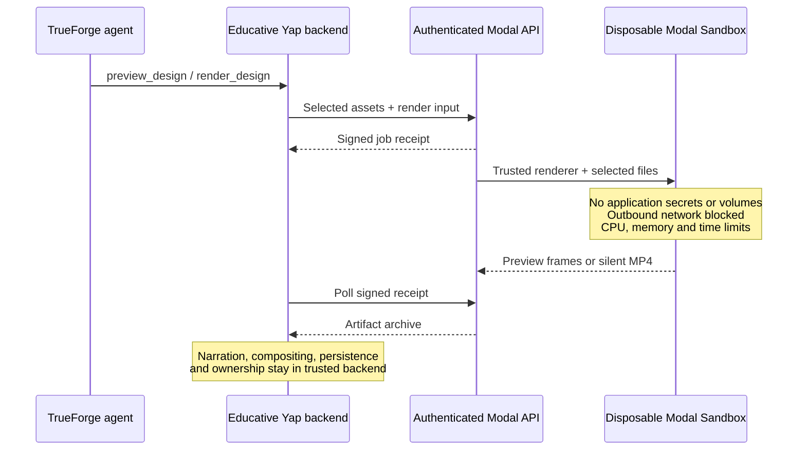

# Educative Yap: isolated Modal rendering

Educative Yap has its own Modal app, `educative-yap-renderer`. It uses the same provider account pattern as Make My Reels, but no Make My Reels app, worker, volume, or secret bundle. TrueForge remains the agent orchestrator; this is an explicit render adapter, **not a built-in TrueForge Modal sandbox provider**.



## Deploy

1. Install Modal CLI in a dedicated Python environment and authenticate to the intended provider account.
2. Create a dedicated random `YAP_MODAL_RENDER_TOKEN`. Keep it in an ignored file or deployment secret store, never source control.
3. Store **only that token** in the Modal secret `educative-yap-render-auth`:

   ```sh
   modal secret create educative-yap-render-auth --from-json /private/path/render-auth.json
   modal deploy modal/renderer.py
   ```

   The JSON has the shape `{"YAP_MODAL_RENDER_TOKEN":"<random-secret>"}`.
4. Put the printed API URL in backend `YAP_MODAL_RENDER_URL`, and the same token in backend `YAP_MODAL_RENDER_TOKEN`. These are server-side variables, never `NEXT_PUBLIC_*` or browser configuration.
5. Redeploy the Modal app when trusted renderer source or pinned dependencies change.

The build copies six explicitly named trusted TypeScript files, the bundled cafe image, and a minimal pinned npm manifest. It never uploads `.env`, `.data`, application credentials, or existing videos into the image. The endpoint authentication secret is attached to the API function only; no secret is attached to the render job or its child Sandbox.

## Execution boundary

`src/modal-render.ts` packages `render-input.json`, declared image metadata/blobs and declared clip metadata/JPEG frames. It rejects symbolic links and bounds transfer sizes. The API validates archive paths and refuses links, undeclared files and traversal. The Sandbox receives those files via Modal's filesystem API, not storage credentials or an R2 mount.

Every render uses a new Sandbox with `block_network=True`, `secrets=[]`, `volumes={}`, and OIDC identity tokens disabled. It has 2 requested / 4 maximum CPUs and 4 GiB requested / 8 GiB maximum RAM. Previews have a five-minute worker limit; exports scale with duration up to 7,500 seconds. Cleanup calls `terminate()` in a `finally` block; the Sandbox timeout is also a backstop after control-plane interruption.

The existing `authored-worker.ts` runs unchanged, preserving three-frame preview, backward-seek determinism checking, authored HTML/SVG/Canvas/GSAP, declared still images, decoded clip playback, host captions and image credits. Generated JavaScript runs inside browser isolation inside the disposable Sandbox. The trusted backend still performs TTS, narration mixing and presenter compositing.

## Async jobs and limits

Submission returns a signed Modal FunctionCall receipt. The backend polls completion rather than holding a single render HTTP request open. The receipt is stored alongside the local project/design job and reused for identical content after a retry. It does not contain the authentication token. Modal retains asynchronous call results for up to seven days; application artifact persistence is still required for longer storage.

Inputs are limited to **100 MiB compressed / 250 MiB expanded**, outputs to **250 MiB**. The image supports the app's 20-minute duration ceiling, but a full 20-minute cloud export must be benchmarked before advertising it as verified. Large media transfers and two simultaneous cloud compute layers (trusted job + Sandbox) have real costs. The existing AI-token ledger does not include Modal compute or storage fees.

## Verification

The deployed API is `https://sanjuhs123--educative-yap-renderer-api-v2.modal.run`; it requires the private backend token. On 2026-09-26, actual cloud tests passed: HTTP 401 without credentials, the network/credential isolation probe, three preview frames with backward-seek determinism, a 2-second 1080×1920 H.264 export, and previewing the existing 60-second Korean War plan with its two image assets and archival clip.

```sh
python3 -m unittest discover -s modal
npm run check
modal run modal/renderer.py::isolation_probe
```

`isolation_probe` tests the exact Sandbox configuration for absence of service credential variables and `.env`, and verifies a direct outbound socket attempt is blocked. It returns variable **names** only, never values. This is an integration test of the configured boundary, not proof against every possible browser/kernel vulnerability. Test authenticated/unauthenticated API access and a preview/final MP4 smoke job after deployment.

References: [Modal Sandbox networking](https://modal.com/docs/guide/sandbox-networking), [filesystem transport](https://modal.com/docs/guide/sandbox-files), [asynchronous jobs](https://modal.com/docs/guide/job-queue).
