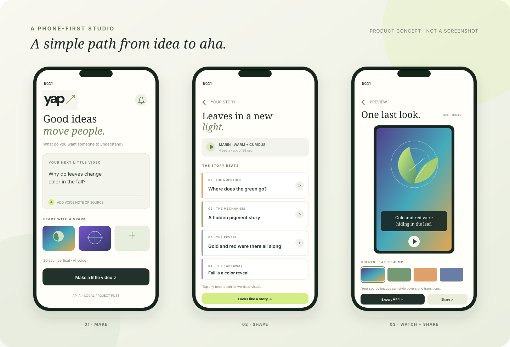
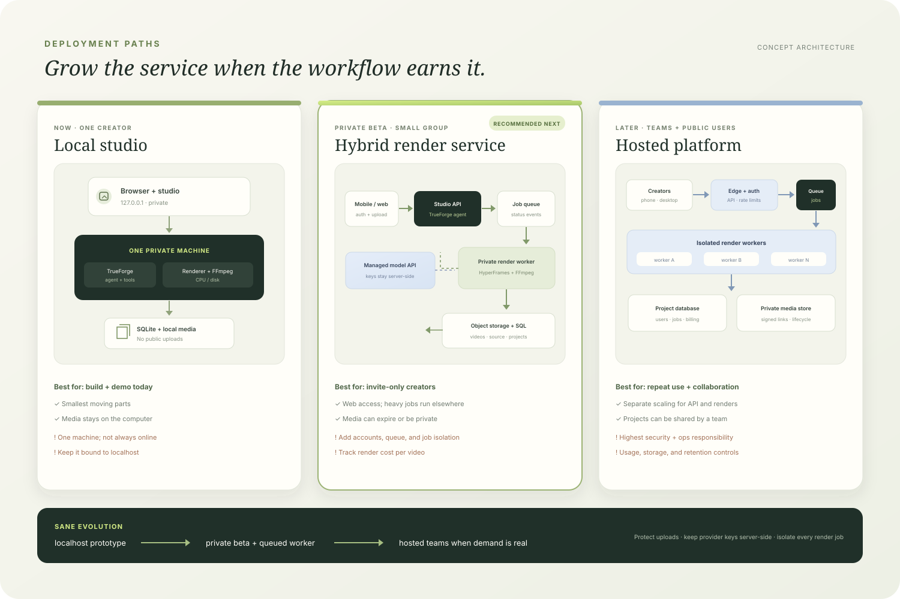
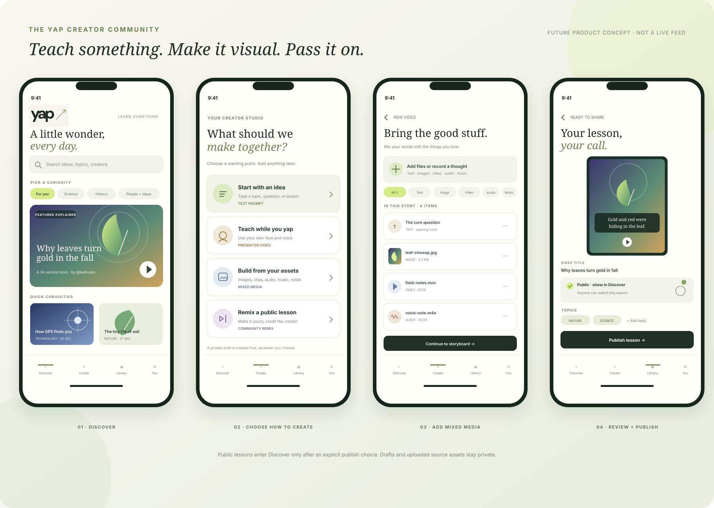
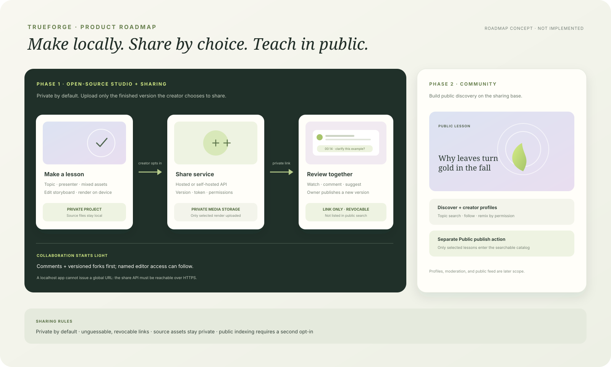

# Product concepts

These concepts are separate from the implemented creator studio.

## How the studio could feel on a phone

The current web studio is a good desktop starting point. On a phone, make the
main flow feel like three focused steps: **make an idea → shape its beats →
watch and share**. Keep the 9:16 video preview prominent, storyboard edits
lightweight, and the main action near the bottom edge. A responsive installable
web app is a practical first mobile release; native apps can wait until voice
capture, camera, or OS share-sheet features earn the extra work.

  

On desktop, keep the current prompt-and-preview layout, then let the storyboard
open beside the player for revisions. The generated photosynthesis and GPS
images also work as ad backgrounds or cover art: crop around the subject, leave
space for a short headline, and use a soft gradient scrim so text stays clear.

<table>
  <tr>
    <td width="50%"></td>
    <td width="50%"></td>
  </tr>
  <tr><td align="center">Sunlight becomes a visual story</td><td align="center">Signals find a place on Earth</td></tr>
</table>

## Deployment paths

Use localhost for development and the hackathon demo. The first community-ready
step is a small **hybrid share beta**: creators keep making and rendering videos
locally, then explicitly upload a finished video to a hosted share service to
get a global review link. That service owns link permissions, comments, and
version history; it does not need to run the renderer in phase 1. A private
worker and render queue can come later if remote rendering becomes necessary.
Keep provider keys server-side and isolate every hosted job.

  

| Model                | Best for                          | Tradeoff                                                    |
| -------------------- | --------------------------------- | ----------------------------------------------------------- |
| Local studio         | Building and live demos           | A link is not globally reachable; media stays on one device |
| Hybrid share beta    | Phase 1 review and collaboration  | Needs a reachable API, identity, and private media storage  |
| Hosted community app | Phase 2 public discovery at scale | Highest operating and moderation burden                     |

The current services bind to `127.0.0.1` and are for personal local use. Do not
port-forward them or expose them directly to the internet. A hosted version
needs authenticated project access, upload limits, isolated jobs, private media
links, and storage/usage cleanup before inviting users.

## Product direction: make together, share by choice

The project stays **open source**. Phase 1 makes the creation workflow useful
on its own and adds an opt-in path to share a finished lesson through a global
link. Phase 2 can grow that sharing foundation into a public teaching
community. A link shared with collaborators is not automatically a public post.

### Phase 1 · Open-source studio with share links

Creators make a lesson locally, keep it private by default, and choose whether
to upload a finished version to a hosted share service. The share page can offer
playback, a version timeline, and time-coded feedback. The owner can invite
collaborators to comment; later, an explicit editor invite can allow a trusted
person to fork or revise the project. Start with review and versioned forks
rather than simultaneous editing, which keeps the first collaboration model
small and understandable.

- **Private** means only the creator can access the project.
- **Link only** means anyone holding a revocable, unguessable link can view and
  comment, subject to the creator's settings. It is not indexed in Discover.
- **Public** is a separate future choice for listing a lesson in the community.

Share only the rendered video and metadata the creator selects. Keep original
recordings, transcripts, credentials, and editable project assets private by
default. The open-source repo can include a self-hostable share service, while a
small hosted instance gives collaborators a stable global URL. Localhost alone
cannot create a globally reachable link. This first version does **not** yet
implement uploads, share links, comments, accounts, or collaboration; those are
the next product milestones.

### Phase 2 · Discover and teach in public

Once link sharing works, add a public catalog of lessons creators explicitly
publish, profiles, topic discovery, follows, and opt-in remix permissions. The
mobile app can then use four destinations: **Discover**, **Create**, **Library**,
and **You**. Put Create in the center of the bottom bar. Discover is for public
lessons; Library holds private drafts and finished work; You contains the
creator's profile and publishing settings.

Create should offer distinct starting points rather than one oversized prompt:

- **Explain an idea:** topic, notes, pasted text, or a lesson outline.
- **Teach on camera:** the presenter video and voice path that already exists.
- **Build from assets:** add images, source clips, voice, music, and notes; give
  every asset a role and let creators order or remove it before rendering.
- **Remix a lesson:** start from a public video when its creator allows reuse,
  with attribution carried into the new draft.

The current app supports topic-driven explainers and presenter video with an
optional aligned voiceover. The general mixed-media tray, share links,
collaboration, remix workflow, public profiles, publish controls, and Discover
feed are **product concepts**, not working features yet. Add media types in
stages: show local previews and file details first; then wire each accepted type
into the storyboard and renderer.

The phone screens below illustrate the eventual Phase 2 community shell. Phase 1
would replace the public publish screen with a **Share link** review flow; public
Discover remains a separate opt-in once the catalog exists.

  

In phase 1, make **Private** the default and **Link only** the explicit share
action. Use expiring or revocable random tokens, signed media URLs, and an owner
control to close access. Store project/version metadata separately from media;
never use GitHub as the video library. In phase 2, add **Public** as a separate
publish action that writes approved metadata into a searchable catalog. Keep
source recordings, transcripts, and editable files private unless selected
individually.

  

